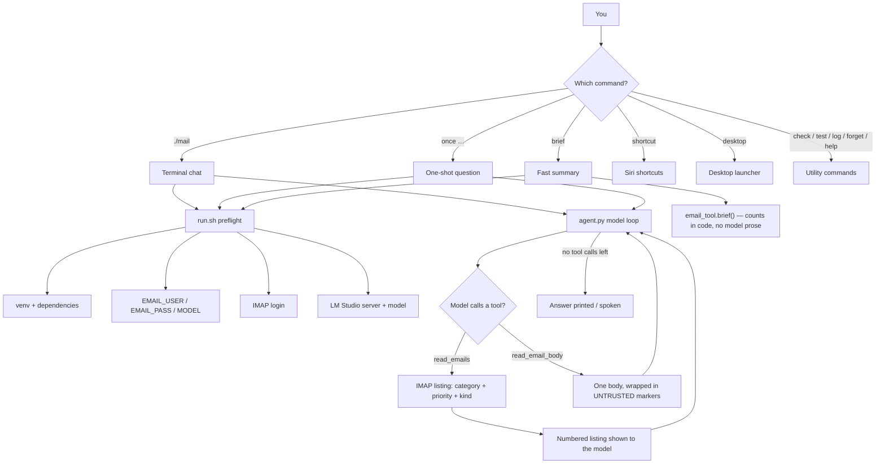
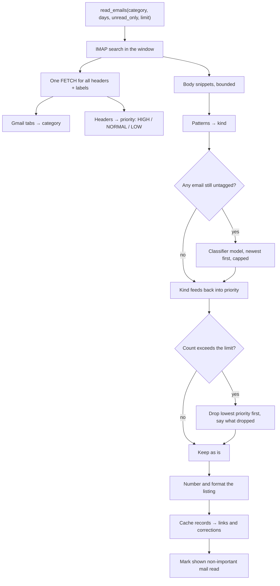
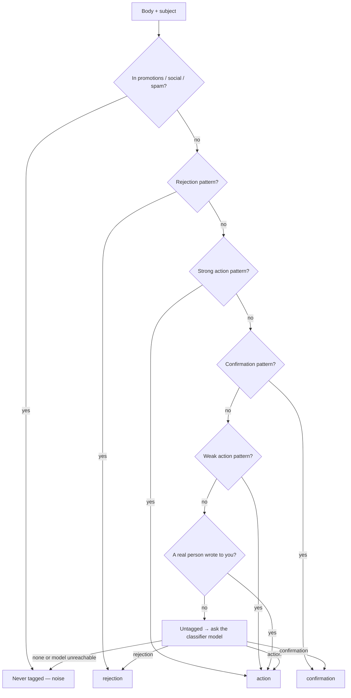

# Feature Map & How It Works

A companion to [README.md](README.md): every feature, how the pieces fit
together, and how to use each one.

**What this is:** an inbox triage agent. It reads your Gmail over IMAP, tags
each email by what it *is* (needs-a-reply / rejection / confirmation / noise),
and answers questions about the result through a local model running in LM
Studio. Nothing leaves your machine. There is no send, no delete, no shell, no
file access — not as a rule the model is asked to follow, **those capabilities
do not exist in the process.** The one deliberate write: mail it summarizes is
marked read unless it needs a reply or is HIGH priority (`MARK_READ=false`
turns that off).

The diagrams below render on GitHub and in most Markdown editors (VS Code with
the Mermaid extension).

---

## At a glance

| Feature | Entry point | What it does |
|---|---|---|
| Terminal chat | `./mail` | Colored, memory-backed conversation |
| One-shot question | `./mail once "…"` | A single question, then exit |
| Fast brief | `./mail brief` | Fixed summary in seconds, no model prose |
| Siri shortcuts | `./mail shortcut` | "Check My Emails" + "Ask My Email" |
| Desktop launcher | `./mail desktop` | Double-click chat app on the Desktop |
| Preflight | `./mail check` | Verifies venv, `.env`, mailbox, model |
| Offline tests | `./mail test` | 133+ regression tests, no network |
| Siri log | `./mail log` | What Siri asked and answered |
| Forget | `./mail forget` | Clears saved conversations |
| Scheduled digest | *scheduler.py* | launchd digest on a plain-English interval |
| Mark mail read | automatic | seen mail stops reappearing; important stays unread |

---

## How it all fits together



### A question becomes an answer

1. You run `./mail` (chat), `./mail once "…"` (one-shot), or a Siri shortcut.
2. `run.sh` preflights in order — venv, `.env`, IMAP login, LM Studio server —
   so a failure names the one thing that is wrong.
3. `agent.py` starts a loop: it sends the conversation to the model, and the
   model may call **`read_emails`** (list mail) or **`read_email_body`** (read
   one message). There are no other tools.
4. Tool results come back as facts the model must not re-derive; the model
   answers the question that was asked and stops.
5. The reply is printed (chat), shown on screen (Siri), and the conversation is
   saved so a follow-up like *"what about the last 3 days?"* still knows what
   you meant.

### The `read_emails` pipeline



### How one email gets its tag



The patterns run first — instant, free, deterministic. The model is asked only
about what is left, one email at a time, answering a single word (~0.7s each).
Each covers the other's weakness: patterns never drift, the model handles
wording nobody wrote a rule for.

---

## The features, one by one

### 1. Terminal chat — `./mail`

The main event. A colored, readline-enabled REPL:

- **Arrow keys** scroll back through what you typed (history persists across
  sessions).
- A **status line** ("Reading your inbox…" / "thinking…") shows what is doing
  while the model works, then the answer replaces it.
- Answers print with an `Agent:` prefix; **Gmail links** follow as a dimmed
  footnote.
- If LM Studio drops mid-chat you get a friendly red message, not a traceback.

Tasks you can type:

| You type | What happens |
|---|---|
| `what needs my attention?` | Full triage of the last 24h |
| `how many rejections do I have?` | Specific answer |
| `anything from Google?` | Filtered answer |
| `what came in the last 3 days?` | Same question, wider window |
| `links` | Gmail links for the last listing (all, not just important) |
| `3 is a rejection` | Teach it a tag it got wrong |
| `new` / `start over` / `reset` | Forget this conversation |
| `help` / `?` | Show the banner again |
| `quit` / `exit` | Leave |

Anything else is sent to the model. The chat keeps its own session (`terminal`),
separate from the voice one, so a half-finished spoken question never bleeds
into what you are typing.

**Use it:** `./mail` — or `./mail --days 3` to start three days back.

### 2. One-shot question — `./mail once "…"`

Ask one question, get one answer, exit. No banner, no prompt.

```bash
./mail once "any interviews this week?"
./mail once "anything in promotions worth keeping?"
./mail once --days 7 "summarize everything from last week"
```

- `./mail once` with **no text** falls back to the standard triage — that is
  what cron uses.
- Any **unknown word** to `./mail` is treated as a question: `./mail any
  interviews?` works the same as the `once` form above.

### 3. Fast brief — `./mail brief`

A fixed, multi-line summary built entirely from tags computed in code — no
model loop writing prose — so it returns in seconds instead of a minute-plus.
That is why Siri and launchd use it.

```
26 new emails today.

Needs a reply (1):
• Acme — Interview Thursday

Rejections (4): grifols, newsela, mail-delivery@google.com, linkedin-notifications
12 applications acknowledged.
```

Newlines read as sections on a Siri card and as pauses in spoken text, so one
format serves both.

**Rejection detection now covers:**
- **Job application rejections** — "unfortunately", "not moving forward", "other candidates", "position filled"
- **Email delivery failures / bounces** — "Delivery Status Notification", "undelivered mail", "mailbox full", "recipient rejected", "host unknown", "spam rejected", "blacklist"
- **LinkedIn / job platform rejections** — "application status: rejected", "we regret to inform you that your application was declined" from LinkedIn, Indeed, Glassdoor, etc.

### 4. Siri shortcuts — `./mail shortcut`

Generates **two signed shortcuts** you install by clicking Add Shortcut:

| Shortcut | Say | Does |
|---|---|---|
| Check My Emails | "Hey Siri, Check My Emails" | today's summary, on screen in ~20s |
| Ask My Email | "Hey Siri, Ask My Email" | asks what you want, then answers |

`Ask My Email` is a conversation — it passes `--session siri`, so a follow-up
in the same 15 minutes still knows what you meant. Setup, timing and
troubleshooting live in **[shortcuts/README.md](shortcuts/README.md)**.

### 5. Desktop launcher — `./mail desktop`

Drops a double-clickable **`Mail Agent.command`** on `~/Desktop`. Double-click
it and a Terminal window opens straight into the chat; the window stays open
after you quit so you can read the session.

- The project path is embedded — **re-run `./mail desktop` if you move the
  folder** (the launcher tells you if it can't find the agent).
- The same command is idempotent: running it again just rewrites the file.

### 7. Scheduled digest — `scheduler.py`

Parses plain-English intervals, installs a macOS launchd LaunchAgent
(`launchctl bootstrap`), reports status, and stops:

- `"check every 2 hours"`, `"schedule every 30 minutes"`, `"run every 4h"` → an
  interval (clamped to 15 min – 24 h)
- `status` / `scheduling?` → current schedule
- `stop` / `cancel checking` → remove the launchd job
- Survives reboots and runs late if the Mac was asleep (launchd, not cron)
- Logs to `schedule.log`

The chat (`You:` prompt) and the `--once` path both detect scheduling phrases
in code, before the model sees them, so email text can never trigger a job.
The launchd job runs `./mail brief --notify`, which sends a macOS notification
with the digest — failures notify too, so a broken digest is visible. Idempotent:
setting a new interval replaces the job rather than stacking a second one.

### 8. Conversation memory — `.sessions/`

Follow-ups resolve against earlier answers:

```
You: how many rejections do I have?
Agent: Three: Adobe, Notion, Hinge Health.

You: what about the last 3 days?
Agent: Seven over three days: Adobe, Notion, Hinge Health, Stripe, …
```

- Sessions live in `.sessions/` (gitignored), one JSON file per name, names
  sanitized against path traversal.
- **Expire after 15 minutes** — a "today" from this morning should not still
  be in context tonight.
- Capped at 40 messages so a long chat can't run away with the context window.
- `new` in the chat, or `./mail forget`, clears it.

### 9. Tag corrections — teaching it a kind

```
You: 3 is a rejection
Noted: #3 is 'rejection', not 'untagged'. Saved as an example.
```

Valid labels: `rejection`, `action`, `confirmation`, `none`. Saved to
`.corrections.json` (gitignored) and pasted as an example into every future
classification — so it applies from the **next** email onward. Be clear about
what this is: the model is never trained and its weights never change.
Deleting `.corrections.json` reverts the behaviour exactly.

### 10. Gmail links

After each answer, clickable Gmail links print for anything important. Built
in code from `X-GM-THRID` — deliberately never shown to the model, because a
small model garbles long URLs when repeating them. `links` shows every link in
the last listing; otherwise only important ones.

### 11. Siri logging — `./mail log`

Every voice run appends a timestamped line to `siri.log` — the request, the
reply, and any error. Siri runs headless, so without this a blank card leaves
nothing to debug from. An `ASK` with no matching `REPLY` means the run never
finished (usually the model was still loading). The file holds email subjects
and senders, so it is gitignored.

```bash
./mail log        # last 40 lines
./mail log 200    # last 200 lines
tail -f siri.log  # follow live
```

### 12. Preflight — `./mail check`

`run.sh --check` walks the four things the agent needs, in order, so a failure
names the one thing that is wrong: venv + dependencies, `.env`, IMAP login,
and the LM Studio server/model. `run.sh` runs it automatically before starting
anything; `./mail check` runs it and stops.

### 13. Offline tests — `./mail test`

133 regression tests with **no network, no mailbox, no model** — they run on
constructed messages, so they work on a fresh clone. Most are regressions: each
is a bug that shipped and was only caught against a real inbox.

### 13. Marking mail read — automatic

Every email the agent shows you is marked **read** in Gmail, so it stops
reappearing the next time you ask. This is the process's one deliberate write;
everything else stays read-only.

What stays **unread**:

- `[action]` mail — interviews, assessments, a real person writing to you
- anything rated `HIGH` priority

Everything else the agent lists — rejections, confirmations, untagged mail —
is marked read. Mail that was dropped because the listing hit its limit is
**never** marked: you never saw it, so it stays for next time.

- Turn it off: `MARK_READ=false` in `.env` → strictly read-only again.
- Applies to every entry point (chat, `once`, `brief`, Siri) because they all
  read through the same `read_emails()` path.
- Best-effort: a failed flag-write logs a warning and never loses the listing.

---

## Command reference

```bash
./mail                    # chat with your inbox
./mail brief              # fast fixed summary (what Siri runs)
./mail once "…"           # a single question, then exit
./mail log [N]            # what Siri asked and answered (last N lines)
./mail shortcut           # build the two Siri shortcuts
./mail desktop            # put a chat launcher on the Desktop
./mail check              # preflight only, don't start
./mail test               # offline test suite
./mail forget             # clear saved conversations
./mail help               # this list
./mail <anything else>    # treated as a question

--days N                  # how far back to look, default 1
```

## Tasks it can do — and cannot

| Task | How |
|---|---|
| What needs my attention | `./mail` or `./mail once "what needs my attention?"` |
| Rejections / interviews / confirmations | any question naming them |
| Bounced / delivery-failed emails | detected automatically as rejections |
| LinkedIn / job platform rejections | detected automatically as rejections |
| Summarize a sender or a day | `./mail once "summarize what Google sent"` |
| Check spam for real mail | `read_emails(category="spam")` via a question |
| Look further back | `--days 3`, or "the last 3 days" in conversation |
| Fix a wrong tag | `3 is a rejection` |
| Get links to specific mail | `links`, or follow the links after an answer |
| Stop old mail reappearing | automatic — marked read after each summary |
| Run it on a schedule | `check every 2 hours` (launchd digest) |
| Send / delete / rewrite mail | **never** — the tools don't exist |
| Read mail on your phone | **no** — Siri on iPhone can't run shell scripts |
| Use Outlook / non-Gmail | partial — categories degrade, see README |

## Configuration — `.env`

| Variable | Default | Does |
|---|---|---|
| `EMAIL_USER` | — | your address (legacy single-account) |
| `EMAIL_PASS` | — | app password (legacy single-account) |
| `EMAIL_NAME` | — | friendly name for legacy account (shown in output) |
| `EMAIL_USER_N` | — | additional accounts (N=1..9): `EMAIL_USER_1`, `EMAIL_PASS_1`, `EMAIL_NAME_1`, `EMAIL_HOST_1` |
| `MODEL` | — | must match the LM Studio model exactly |
| `IMAP_HOST` | `imap.gmail.com` | default IMAP host for accounts without `EMAIL_HOST_N` |
| `LM_BASE_URL` | `http://localhost:1234/v1` | LM Studio server |
| `MAX_EMAILS` | `50` | hard ceiling per listing (default ask is 15) |
| `CORRECTIONS_FILE` | `.corrections.json` | where corrections live |
| `SPAM_FOLDER` | `[Gmail]/Spam` | non-Gmail spam folder name |
| `MARK_READ` | `true` | mark summarized mail as read; `false` = strictly read-only |

### Multi-account setup

If any `EMAIL_USER_N` / `EMAIL_PASS_N` pair is set, the legacy `EMAIL_USER` / `EMAIL_PASS` are **ignored** and only the numbered accounts are used. Each numbered account can have its own:

- `EMAIL_USER_N` — email address (required)
- `EMAIL_PASS_N` — app password (required)
- `EMAIL_NAME_N` — friendly name (optional, defaults to local-part of email)
- `EMAIL_HOST_N` — IMAP host (optional, defaults to `IMAP_HOST`)

This lets you mix Gmail and Outlook accounts in one triage:

```bash
# Legacy single account (still works alone)
EMAIL_USER=personal@gmail.com
EMAIL_PASS=abcdefghijklmnop
EMAIL_NAME=personal

# Multi-account: any numbered pair activates multi-account mode
EMAIL_USER_1=work@company.com
EMAIL_PASS_1=qrstuvwxyz123456
EMAIL_NAME_1=work
EMAIL_HOST_1=imap.gmail.com

EMAIL_USER_2=other@outlook.com
EMAIL_PASS_2=mnopqrstuvwxyz12
EMAIL_NAME_2=other
EMAIL_HOST_2=imap-mail.outlook.com
```

Emails from all configured accounts are combined into a single listing, globally ranked by priority (HIGH/NORMAL/LOW), with each entry tagged by its account name (e.g., `[work]`, `[personal]`).

## Security model

- **Read-only, structurally — with one deliberate write.** `BODY.PEEK` means
  fetching never sets `\Seen`, and nothing can be sent, deleted, or modified.
  The single exception: mail the agent summarizes is marked read unless it
  needs a reply or is HIGH priority. `MARK_READ=false` turns even that off.
- **Nothing leaves your machine.** IMAP to your provider, HTTP to localhost.
  No third-party API, no telemetry.
- **Email content is treated as hostile.** Bodies are fenced in `UNTRUSTED`
  markers and the model is told they are data, never instructions. Since it
  has no tools that can act, an injected email has nothing to reach for.
- `.env`, `.corrections.json`, `.sessions/`, `siri.log` and `schedule.log` are
  gitignored.

## Where the code lives

| File | Owns |
|---|---|
| `mail` | command dispatcher / usage |
| `run.sh` | preflight: venv, `.env`, IMAP, LM Studio; `--shortcut`, `--desktop` |
| `agent.py` | the model loop, prompt, tool schemas, the chat UI |
| `email_tool.py` | IMAP, categories, priority, kinds, `brief()`, links, corrections, mark-read |
| `classifier.py` | model-judged kind tags + your corrections |
| `session.py` | conversation memory (TTL, cap, sanitized names) |
| `ui.py` | terminal colours + the transient "thinking" status line |
| `scheduler.py` | launchd digest on a plain-English interval |
| `shortcuts/` | Siri shortcut generator + shell runners + desktop launcher |
| `test_agent.py` | 133 offline regression tests |
